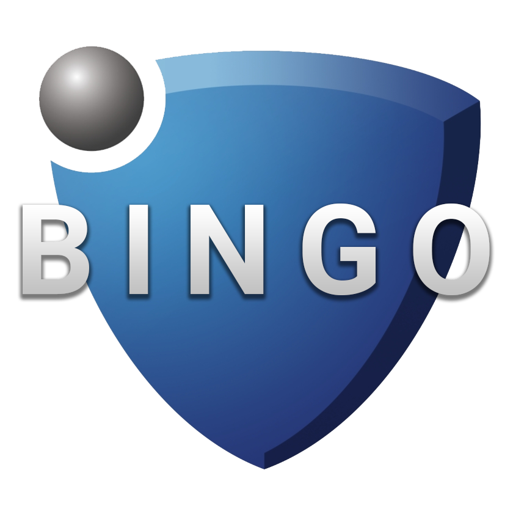

# Rocket League Bingo

---

Inspired by the gamemode by popular Rocket League Content Creator [SunlessKhan](https://www.youtube.com/c/sunlesskhan), this is Rocket League Bingo.

### How to play

Just like old fashioned paper bingo, the rules are simple. Complete the challenges in the game to cross them off the card. Once you get 5 (five) challenges completed in a row (horizontally, vertically, or diagonally), you win!

If you want to keep playing, just reload the page and you will get a new randomized bingo card!

### About the project

This project is written in the [VueJS](https://vuejs.org/) Javascript Framework.
There is currently no backend set up for this application.

### Contributions

If you would like to contribute to the project please submit a pull request! This is an open source project and contributions are encouraged!

---

### Project setup

```bash
npm install
```

### Compiles and hot-reloads for development

```bash
npm run serve
```

### Compiles and minifies for production

```bash
npm run build
```

### Lints and fixes files

```bash
npm run lint
```

### Customize configuration

See [Configuration Reference](https://cli.vuejs.org/config/).
